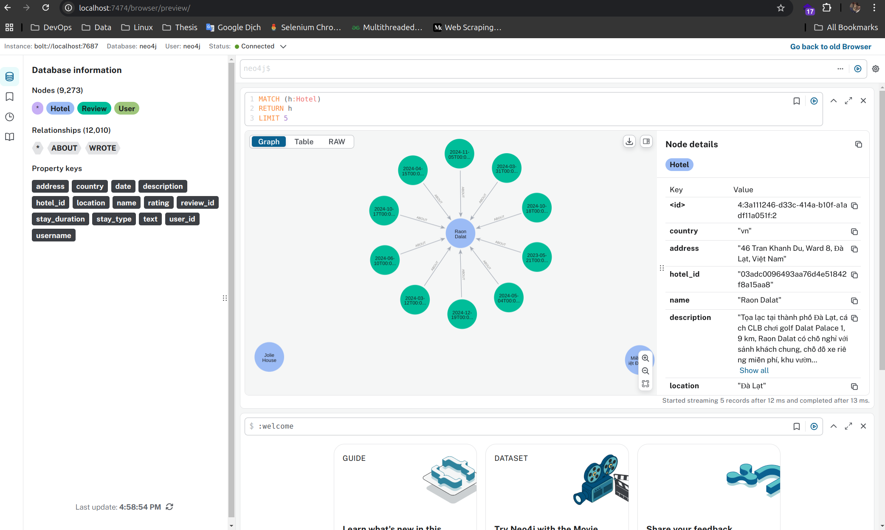

# DaLat Booking Recommendation Chatbot

   

- This project is about booking hotels recommendation chatbot on Vietnamese hotels using GraphRag.

## Usage

### Prerequisites

#### 1. Python packages

- Install package [uv](https://github.com/astral-sh/uv):

```bash
# On macOS and Linux.
curl -LsSf https://astral.sh/uv/install.sh | sh

# On Windows.
powershell -ExecutionPolicy ByPass -c "irm https://astral.sh/uv/install.ps1 | iex"
```

- Activate virtual environment:

```bash
# Create virtual environment.
uv venv --python 3.11

source .venv/bin/activate
```

- Install dependencies:

```bash
uv sync
```

#### 2. Services integration

- Install [Docker](https://docs.docker.com/get-docker/).

- Install `build-essential`:

```bash
sudo apt-get update && sudo apt-get install build-essential -y
```

- Create `.env` file:

```bash
cp .env.example .env

# Then, update the values.
```

> [!NOTE]
> `NEO4J_PASSWORD` must not be `neo4j`, then the Neo4j database will not start.

- Start services:

```bash
docker compose up -d

# or

make up
```

- Check the Neo4j database at `http://localhost:7474/browser/` or `http://localhost:7474/browser/preview/`. Login with your password and username specified in the `.env` file.

### Initialize Neo4j Graph Database

- The above services are running, then initialize the dimension and fact data with:

```bash
make transform
```

- Then we will have the graph data at these paths:

```bash
scraper/booking/output/warehouse/dim_hotel.parquet
scraper/booking/output/warehouse/dim_user.parquet
scraper/booking/output/warehouse/fact_review.parquet
```

- Load the data into Neo4j:

```bash
make load
```

- If you receive something like this, it means the data is loaded successfully:

```bash
Recommendations for user: d49aedca2af303f3439c9ddcfaa6c534
[{'hotel_id': 'a678288de41a8ae09740c785ce68cb19', 'name': 'Hotel Làng Kò Hơ', 'avg_rating': 10.0, 'review_count': 10}, {'hotel_id': 'b146903aee22801c928654c2e5ea5158', 'name': '296 Cetete - Home in Dalat', 'avg_rating': 10.0, 'review_count': 10}, {'hotel_id': '72229f4f874507f22c2e625ebc969dc8', 'name': 'Tuan Thuy Hotel', 'avg_rating': 10.0, 'review_count': 10}, {'hotel_id': '2a5e2e19df11a5afd54712afdff21502', 'name': 'Khách Sạn Đà Lạt View- Đà Lạt View Hotel', 'avg_rating': 10.0, 'review_count': 10}, {'hotel_id': '48eedf27f35cba1e5948c35be44ffb59', 'name': 'EURO HOUSE', 'avg_rating': 10.0, 'review_count': 10}]

Similar hotels to: d25d0d6a3f0f42b19482c3d6f16b7fbf
[{'hotel_id': 'b4af9e494c116dd2cdbdc3ea8e43a7d9', 'name': 'Đà Lạt Sunshine Garden', 'avg_rating': 10.0, 'review_count': 1, 'common_users': 1}, {'hotel_id': 'e522226e425ec0f82c0f77d389df2e21', 'name': 'NK.Dalat Hotel', 'avg_rating': 10.0, 'review_count': 1, 'common_users': 1}, {'hotel_id': '23bc46575562083fe796854a0f976987', 'name': 'Seven A Hotel', 'avg_rating': 10.0, 'review_count': 1, 'common_users': 1}, {'hotel_id': '7dc015e78f62b21a5616aba5d192aabc', 'name': 'Hostel-John Cafe and Beer', 'avg_rating': 9.0, 'review_count': 1, 'common_users': 1}, {'hotel_id': 'c0770a843f039342865a9dc11277cd2c', 'name': 'Dalat Terrasse Des Roses Villa', 'avg_rating': 9.0, 'review_count': 1, 'common_users': 1}]

Sample query:
[{'hotel_id': 'f8dd9fa66a227ffede2937d71ad05921', 'name': 'Dalat Wind Deluxe Hotel'}, {'hotel_id': 'fb401270b8babc2109a6dea17d1ebba2', 'name': 'Miền Nhiệt Đới 2 Hotel'}, {'hotel_id': '03adc0096493aa76d4e51842f8a15aa8', 'name': 'Raon Dalat'}, {'hotel_id': '9bb7114f0c3873e5398496dd7e140f5e', 'name': 'Royal Palace'}, {'hotel_id': '4a23f6c840d5b9f8d9f38fe289418a31', 'name': 'Jolie House'}]
```

- Go to `http://localhost:7474/browser/` or `http://localhost:7474/browser/preview/`, you can see some UI like this:



> Check the number of nodes and relationships in the UI to see if the data is loaded successfully.

- Then, you can query the data with Cypher query language:

> Example query just return Table of 5 hotels

```cypher
MATCH (h:Hotel)
RETURN h.hotel_id as hotel_id, h.name as name
LIMIT 5
```

